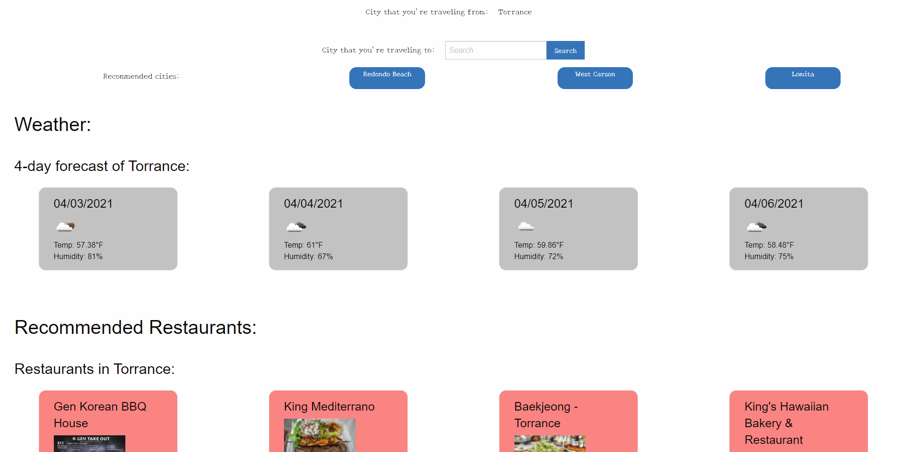
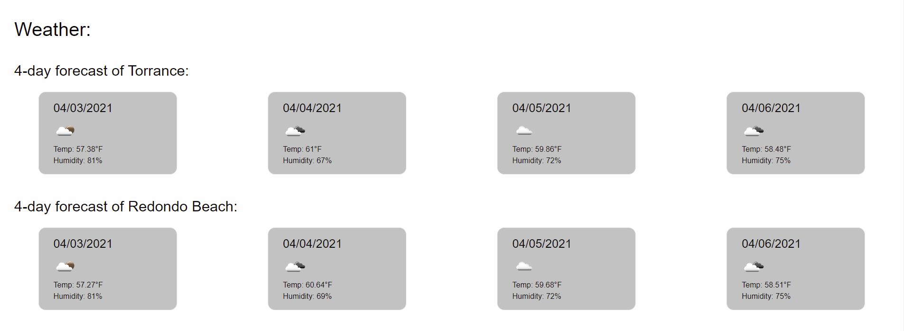
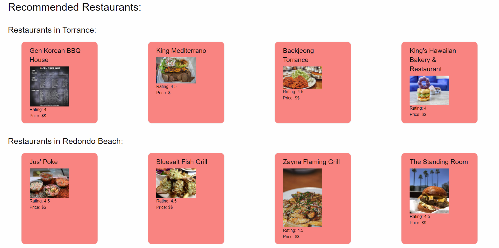

# Gathering of Informed Traveler

## Purpose
This app is created to allow travelers to check the weather and recommended 
restaurants of a given set of cities. The app aids the traveler to plan 
their trip by recommending cities nearby them.

## Demo
The home screen:

After searching in the "City that you're traveling from:" search bar:

Result of the weather cards after searching for the city that the traveler is traveling to:

Result of the restaurant cards after searching for the city that the traveler is traveling to:

## Built With
* HTML
* CSS
* JavaScript
* Third-party API (Foundation, jQuery, moment.js)
* Server-side API (OpenWeatherMap, GeoDB Cities, Yelp)
* cors-anywhere (by Rob--W on Github: https://github.com/Rob--W/cors-anywhere)

## Website
https://raytakemura.github.io/project-1-ucla/

## Contribution
Ray Takemura, Blaze Lim, Michael Temblador 

&copy; The Taco Trio
